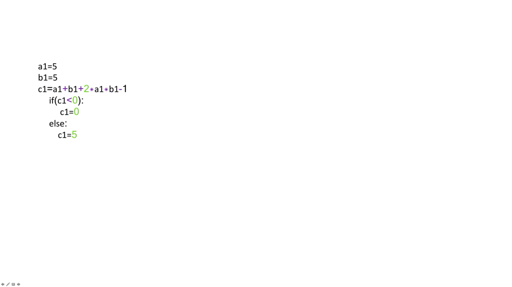

# Functions in Python
* * * * *

This will teach you about the functions in the Python Programming Language. By the end of this lab, you'll know the basic concepts about function, variables, and how to use functions.

## Functions
* * * * *
A function is a reusable block of code which performs operations specified in the function. They let you break down tasks and allow you to reuse your code in different programs.

There are two types of functions :

-   **Pre-defined functions**
-   **User defined functions**

### What is a Function?
* * * * *

You can define functions to provide the required functionality. Here are simple rules to define a function in Python:

-   Functions blocks begin `def` followed by the function `name` and parentheses `()`.
-   There are input parameters or arguments that should be placed within these parentheses.
-   You can also define parameters inside these parentheses.
-   There is a body within every function that starts with a colon (`:`) and is indented.
-   You can also place documentation before the body
-   The statement `return` exits a function, optionally passing back a value

An example of a function that adds on to the parameter `a` prints and returns the output as `b`:

In [1]:

## First function example: Add 1 to a and store as b
* * * * *

def add(a):
    b = a + 1
    print(a, "if you add one", b)
    return(b)

The figure below illustrates the terminology:

We can obtain help about a function :

In [2]:

## Get a help on add function
* * * * *

help(add)

Help on function add in module __main__:

add(a)

We can call the function:

In [3]:

## Call the function add()
* * * * *

add(1)

1 if you add one 2

Out[3]:

2

If we call the function with a new input we get a new result:

In [4]:

## Call the function add()
* * * * *

add(2)

2 if you add one 3

Out[4]:

3

We can create different functions. For example, we can create a function that multiplies two numbers. The numbers will be represented by the variables `a` and `b`:

In [5]:

## Define a function for multiple two numbers
* * * * *

def Mult(a, b):
    c = a * b
    return(c)

The same function can be used for different data types. For example, we can multiply two integers:

In [6]:

## Use mult() multiply two integers
* * * * *

Mult(2, 3)

Out[6]:

6

Two Floats:

In [7]:

## Use mult() multiply two floats
* * * * *

Mult(10.0, 3.14)

Out[7]:

31.400000000000002

We can even replicate a string by multiplying with an integer:

In [8]:

## Use mult() multiply two different type values together
* * * * *

Mult(2, "Michael Jackson ")

Out[8]:

'Michael Jackson Michael Jackson '

### Variables
* * * * *

The input to a function is called a formal parameter.

A variable that is declared inside a function is called a local variable. The parameter only exists within the function (i.e. the point where the function starts and stops).

A variable that is declared outside a function definition is a global variable, and its value is accessible and modifiable throughout the program. We will discuss more about global variables at the end of the lab.

In [9]:

## Function Definition
* * * * *

def square(a):

    # Local variable b
    b = 1
    c = a * a + b
    print(a, "if you square + 1", c)
    return(c)

The labels are displayed in the figure:

We can call the function with an input of **3**:

In [10]:

## Initializes Global variable
* * * * *

x = 3

## Makes function call and return function a y
* * * * *

y = square(x)
y

3 if you square + 1 10

Out[10]:

10

We can call the function with an input of **2** in a different manner:

In [11]:

## Directly enter a number as parameter
* * * * *

square(2)

2 if you square + 1 5

Out[11]:

5

If there is no `return` statement, the function returns `None`. The following two functions are equivalent:

In [13]:

## Define functions, one with return value None and other without return value
* * * * *

def MJ():
    print('Michael Jackson')

def MJ1():
    print('Michael Jackson')
    return(None)

In [14]:

## See the output
* * * * *

MJ()

Michael Jackson

In [15]:

## See the output
* * * * *

MJ1()

Michael Jackson

Printing the function after a call reveals a **None** is the default return statement:

In [16]:

## See what functions returns are
* * * * *

print(MJ())
print(MJ1())

Michael Jackson
None
Michael Jackson
None

Create a function `con` that concatenates two strings using the addition operation:

In [17]:

## Define the function for combining strings
* * * * *

def con(a, b):
    return(a + b)

In [18]:

## Test on the con() function
* * * * *

con("This ", "is")

Out[18]:

'This is'

* * * * *

#### [Tip] How do I learn more about the pre-defined functions in Python?

We will be introducing a variety of pre-defined functions to you as you learn more about Python. There are just too many functions, so there's no way we can teach them all in one sitting. But if you'd like to take a quick peek, here's a short reference card for some of the commonly-used pre-defined functions: [Reference](http://www.astro.up.pt/~sousasag/Python_For_Astronomers/Python_qr.pdf)

* * * * *

### Functions Make Things Simple

Consider the two lines of code in **Block 1** and **Block 2**: the procedure for each block is identical. The only thing that is different is the variable names and values.

#### Block 1:

In [19]:

## a and b calculation block1
* * * * *

a1 = 4
b1 = 5
c1 = a1 + b1 + 2 * a1 * b1 - 1
if(c1 < 0):
    c1 = 0
else:
    c1 = 5
c1

Out[19]:

5

#### Block 2:

In [20]:

## a and b calculation block2
* * * * *

a2 = 0
b2 = 0
c2 = a2 + b2 + 2 * a2 * b2 - 1
if(c2 < 0):
    c2 = 0
else:
    c2 = 5
c2

Out[20]:

0

We can replace the lines of code with a function. A function combines many instructions into a single line of code. Once a function is defined, it can be used repeatedly. You can invoke the same function many times in your program. You can save your function and use it in another program or use someone else's function. The lines of code in code **Block 1** and code **Block 2** can be replaced by the following function:

In [21]:

## Make a Function for the calculation above
* * * * *

def Equation(a,b):
    c = a + b + 2 * a * b - 1
    if(c < 0):
        c = 0
    else:
        c = 5
    return(c)

This function takes two inputs, a and b, then applies several operations to return c. We simply define the function, replace the instructions with the function, and input the new values of `a1`, `b1` and `a2`, `b2` as inputs. The entire process is demonstrated in the figure:

Code **Blocks 1** and **Block 2** can now be replaced with code **Block 3** and code **Block 4**.

#### Block 3:
* * * * *

In [22]:

a1 = 4
b1 = 5
c1 = Equation(a1, b1)
c1

Out[22]:

5

#### Block 4:
* * * * *

In [23]:

a2 = 0
b2 = 0
c2 = Equation(a2, b2)
c2

Out[23]:

0

* * * * *

Pre-defined functions
* * * * *

There are many pre-defined functions in Python, so let's start with the simple ones.

The `print()` function:

In [24]:

## Build-in function print()
* * * * *

album_ratings = [10.0, 8.5, 9.5, 7.0, 7.0, 9.5, 9.0, 9.5]
print(album_ratings)

[10.0, 8.5, 9.5, 7.0, 7.0, 9.5, 9.0, 9.5]

The `sum()` function adds all the elements in a list or tuple:

In [25]:

# Use sum() to add every element in a list or tuple together

sum(album_ratings)

Out[25]:

70.0

The `len()` function returns the length of a list or tuple:

In [26]:

## Show the length of the list or tuple
* * * * *

len(album_ratings)

Out[26]:

8

Using `if`/`else` Statements and Loops in Functions
* * * * *

The `return()` function is particularly useful if you have any IF statements in the function, when you want your output to be dependent on some condition:

In [27]:

## Function example
* * * * *

def type_of_album(artist, album, year_released):

    print(artist, album, year_released)
    if year_released > 1980:
        return "Modern"
    else:
        return "Oldie"

x = type_of_album("Michael Jackson", "Thriller", 1980)
print(x)

Michael Jackson Thriller 1980
Oldie

We can use a loop in a function. For example, we can `print` out each element in a list:

In [28]:

## Print the list using for loop
* * * * *

def PrintList(the_list):
    for element in the_list:
        print(element)

In [29]:

## Implement the printlist function
* * * * *
PrintList(['1', 1, 'the man', "abc"])

1
1
the man
abc

Setting default argument values in your custom functions

You can set a default value for arguments in your function. For example, in the `isGoodRating()` function, what if we wanted to create a threshold for what we consider to be a good rating? Perhaps by default, we should have a default rating of 4:

In [30]:

## Example for setting param with default value
* * * * *

def isGoodRating(rating=4):
    if(rating < 7):
        print("this album sucks it's rating is",rating)

    else:
        print("this album is good its rating is",rating)

In [31]:

# Test the value with default value and with input

isGoodRating()
isGoodRating(10)

this album sucks it's rating is 4
this album is good its rating is 10

* * * * *

Global variables
* * * * ** * * * ** * * * ** * * * ** * * * *-

So far, we've been creating variables within functions, but we have not discussed variables outside the function. These are called global variables.\
Let's try to see what `printer1` returns:

In [32]:

# Example of global variable

artist = "Michael Jackson"
def printer1(artist):
    internal_var = artist
    print(artist, "is an artist")

printer1(artist)

Michael Jackson is an artist

If we print `internal_var` we get an error.

**We got a Name Error: `name 'internal_var' is not defined`. Why?**

It's because all the variables we create in the function is a **local variable**, meaning that the variable assignment does not persist outside the function.

But there is a way to create **global variables** from within a function as follows:

In [33]:

artist = "Michael Jackson"

def printer(artist):
    global internal_var
    internal_var= "Whitney Houston"
    print(artist,"is an artist")

printer(artist)
printer(internal_var)

Michael Jackson is an artist
Whitney Houston is an artist

Scope of a Variable
* * * * ** * * * ** * * * ** * * * ** * * * ** * * * *-

The scope of a variable is the part of that program where that variable is accessible. Variables that are declared outside of all function definitions, such as the `myFavouriteBand` variable in the code shown here, are accessible from anywhere within the program. As a result, such variables are said to have global scope, and are known as global variables. `myFavouriteBand` is a global variable, so it is accessible from within the `getBandRating` function, and we can use it to determine a band's rating. We can also use it outside of the function, such as when we pass it to the print function to display it:

In [34]:

# Example of global variable

myFavouriteBand = "AC/DC"

def getBandRating(bandname):
    if bandname == myFavouriteBand:
        return 10.0
    else:
        return 0.0

print("AC/DC's rating is:", getBandRating("AC/DC"))
print("Deep Purple's rating is:",getBandRating("Deep Purple"))
print("My favourite band is:", myFavouriteBand)

AC/DC's rating is: 10.0
Deep Purple's rating is: 0.0
My favourite band is: AC/DC

Take a look at this modified version of our code. Now the `myFavouriteBand` variable is defined within the `getBandRating` function. A variable that is defined within a function is said to be a local variable of that function. That means that it is only accessible from within the function in which it is defined. Our `getBandRating` function will still work, because `myFavouriteBand` is still defined within the function. However, we can no longer print `myFavouriteBand` outside our function, because it is a local variable of our `getBandRating` function; it is only defined within the `getBandRating` function:

In [35]:

# Example of local variable

def getBandRating(bandname):
    myFavouriteBand = "AC/DC"
    if bandname == myFavouriteBand:
        return 10.0
    else:
        return 0.0

print("AC/DC's rating is: ", getBandRating("AC/DC"))
print("Deep Purple's rating is: ", getBandRating("Deep Purple"))
print("My favourite band is", myFavouriteBand)

AC/DC's rating is:  10.0
Deep Purple's rating is:  0.0
My favourite band is AC/DC

Finally, take a look at this example. We now have two `myFavouriteBand` variable definitions. The first one of these has a global scope, and the second of them is a local variable within the `getBandRating` function. Within the `getBandRating` function, the local variable takes precedence. **Deep Purple** will receive a rating of 10.0 when passed to the `getBandRating` function. However, outside of the `getBandRating` function, the `getBandRating` s local variable is not defined, so the `myFavouriteBand` variable we print is the global variable, which has a value of **AC/DC**:

In [36]:

# Example of global variable and local variable with the same name

myFavouriteBand = "AC/DC"

def getBandRating(bandname):
    myFavouriteBand = "Deep Purple"
    if bandname == myFavouriteBand:
        return 10.0
    else:
        return 0.0

print("AC/DC's rating is:",getBandRating("AC/DC"))
print("Deep Purple's rating is: ",getBandRating("Deep Purple"))
print("My favourite band is:",myFavouriteBand)

AC/DC's rating is: 0.0
Deep Purple's rating is:  10.0
My favourite band is: AC/DC

Quiz on Functions
* * * * ** * * * ** * * * ** * * * ** * * * *--

Come up with a function that divides the first input by the second input:

In [37]:

# Write your code below and press Shift+Enter to execute
def divide(a,b):
    result = a/b
    return result

divide(25,5)

Out[37]:

5.0

Double-click **here** for the solution.

* * * * *

Use the function `con` for the following question.

In [38]:

# Use the con function for the following question

def con(a, b):
    return(a + b)

con(5,2)

Out[38]:

7

Can the `con` function we defined before be used to add to integers or strings?

In [40]:

# Write your code below and press Shift+Enter to execute
# yes
con("Git","Hub")

Out[40]:

'GitHub'

Double-click **here** for the solution.

* * * * *

Can the `con` function we defined before be used to concentrate a list or tuple?

In [41]:

# Write your code below and press Shift+Enter to execute
a = (5,6,3,7)
b = (7,8,9,4)
con(a,b)

Out[41]:

(5, 6, 3, 7, 7, 8, 9, 4)

Double-click **here** for the solution.
